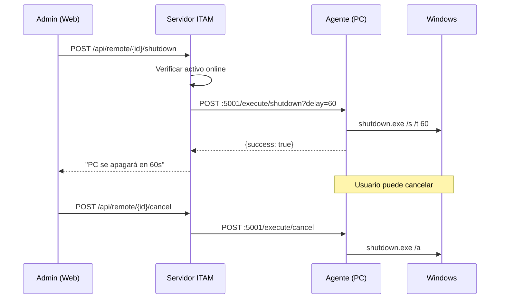

# INFORME TÉCNICO - SISTEMA ITAM
## IT Asset Management Platform

**Fecha:** 09 de Febrero, 2026  
**Versión del Sistema:** 1.1.0  
**Organización:** Poder Judicial del Perú

---

## 1. RESUMEN EJECUTIVO

El Sistema ITAM es una plataforma de gestión de activos de TI que permite el monitoreo en tiempo real de computadoras, impresoras y dispositivos de red. Cuenta con una arquitectura cliente-servidor moderna con múltiples capas de seguridad implementadas.

---

## 2. ARQUITECTURA DEL SISTEMA

```mermaid
flowchart TB
    subgraph "Cliente/Estaciones de Trabajo"
        A[ITAM Agent<br/>Python + WMI]
        CS[Command Server<br/>Puerto 5001]
    end
    
    subgraph "Red Corporativa"
        P[Impresoras<br/>Lexmark/Ricoh]
    end
    
    subgraph "Servidor Central"
        B[Frontend<br/>React 19 + Vite]
        C[Backend API<br/>FastAPI]
        RL[Rate Limiter]
        AL[Audit Logger]
        D[(PostgreSQL<br/>Database)]
    end
    
    A -->|HTTP :8000<br/>Envío datos| C
    CS <--|HTTP :5001<br/>Comandos remotos| C
    P -->|SNMP :161| C
    B -->|REST API + JWT| C
    C --> RL
    C --> AL
    C --> D
```

---

## 3. TECNOLOGÍAS Y LENGUAJES

### 3.1 Backend (Servidor)

| Categoría | Tecnología | Versión |
|-----------|------------|---------|
| **Framework Web** | FastAPI | Latest |
| **ORM** | SQLAlchemy | Latest |
| **Base de Datos** | PostgreSQL | 12+ |
| **Autenticación** | JWT (python-jose) | - |
| **Hashing** | bcrypt (passlib) | - |
| **SNMP** | pysnmp-lextudio | 2.0+ |
| **Scheduler** | APScheduler | Latest |
| **HTTP Client** | httpx | Latest |
| **Excel** | pandas + openpyxl | - |
| **PDF** | ReportLab | - |

### 3.2 Frontend (Web)

| Categoría | Tecnología | Versión |
|-----------|------------|---------|
| **Framework UI** | React | 19.2.0 |
| **Bundler** | Vite (rolldown) | 7.2.5 |
| **Estilos** | TailwindCSS | 3.4.1 |
| **Animaciones** | Framer Motion | 11.18.2 |
| **Iconos** | Lucide React | 0.555.0 |
| **Routing** | React Router DOM | 6.30.3 |
| **HTTP Client** | Axios | 1.13.2 |

### 3.3 Agente (Cliente Windows)

| Categoría | Tecnología |
|-----------|------------|
| **Lenguaje** | Python 3.x |
| **Sistema Info** | WMI |
| **COM Interface** | pythoncom |
| **HTTP Client** | requests/httpx |
| **Servidor Comandos** | Flask/HTTP nativo |

---

## 4. DETALLES TÉCNICOS ADICIONALES

### 4.1 Comandos Remotos

El sistema permite ejecutar comandos remotos desde el panel web hacia las estaciones de trabajo. El agente incluye un servidor HTTP integrado en el puerto **5001** que recibe y ejecuta estos comandos.

| Comando | Endpoint Agente | Descripción |
|---------|-----------------|-------------|
| **Apagar** | `POST /execute/shutdown?delay=60` | Apaga la PC tras 60 segundos |
| **Reiniciar** | `POST /execute/restart?delay=60` | Reinicia la PC tras 60 segundos |
| **Cancelar** | `POST /execute/cancel` | Cancela apagado/reinicio pendiente |

**Características de seguridad:**
- Delay de 60 segundos para permitir cancelación por el usuario
- Verificación de que el activo esté online antes de enviar
- Timeout de 10 segundos para conexión al agente
- Registro en logs de auditoría

**Flujo de comando remoto:**


---

### 4.2 Reportes Generados

El sistema genera reportes exportables en dos formatos:

#### Reporte PDF (`GET /api/reports/pdf`)

| Característica | Detalle |
|----------------|---------|
| **Librería** | ReportLab |
| **Tamaño página** | Letter (carta) |
| **Nombre archivo** | `reporte_inventario.pdf` |

**Columnas incluidas:**
| # | Columna | Descripción |
|---|---------|-------------|
| 1 | Hostname | Nombre del equipo |
| 2 | Estado | Online / Offline |
| 3 | Area | Área organizacional |
| 4 | IP Address | Dirección IP |
| 5 | Usuario | Usuario detectado |

#### Reporte Excel (`GET /api/reports/excel`)

| Característica | Detalle |
|----------------|---------|
| **Librería** | pandas + openpyxl |
| **Formato** | .xlsx (Excel 2007+) |
| **Nombre archivo** | `reporte_inventario.xlsx` |
| **Hoja** | "Inventario" |

**Columnas incluidas:**
| # | Columna | Descripción |
|---|---------|-------------|
| 1 | Hostname | Nombre del equipo |
| 2 | Estado | Online / Offline |
| 3 | Area | Área organizacional |
| 4 | Dominio | Si/No pertenece a dominio |
| 5 | IP Address | Dirección IP |
| 6 | MAC Address | Dirección física |
| 7 | Usuario | Usuario Windows detectado |
| 8 | Marca | Fabricante del equipo |
| 9 | OS | Sistema operativo |
| 10 | Ultimo Reporte | Fecha/hora último contacto |

---

### 4.3 Integración con Otros Sistemas

| Sistema | Estado | Descripción |
|---------|--------|-------------|
| **Active Directory** | ⏳ Parcial | Parser de hostname detecta dominio |
| **SNMP Printers** | ✅ Implementado | Lexmark y Ricoh |
| **SIEM/Logging** | ⏳ Planificado | Vía API audit logs |
| **Email Alerts** | ❌ No implementado | Futuro |
| **LDAP** | ❌ No implementado | Futuro |

---

### 4.4 Agente Python - Especificaciones Técnicas

#### Frecuencia de Envío de Datos

| Parámetro | Valor | Configurable |
|-----------|-------|--------------|
| **Intervalo por defecto** | 300 segundos (5 minutos) | Sí, vía `config.json` |
| **Mínimo permitido** | 10 segundos | Validación en código |
| **Variable de entorno** | `ITAM_REPORT_INTERVAL` | Sí |

#### Información Recolectada via WMI

El agente utiliza Windows Management Instrumentation (WMI) para obtener datos del sistema:

| Clase WMI | Datos Extraídos |
|-----------|-----------------|
| `Win32_ComputerSystem` | Marca (Manufacturer), Modelo (Model), RAM total, Usuario actual |
| `Win32_OperatingSystem` | Nombre del SO (Caption) |
| `Win32_Processor` | Nombre del procesador |
| `Win32_BIOS` | Número de serie (identificador único) |
| `Win32_BaseBoard` | Serial de placa madre (fallback) |

**Datos de red (sin WMI):**
| Fuente | Datos |
|--------|-------|
| `socket.gethostname()` | Hostname |
| `socket.connect("8.8.8.8")` | IP activa |
| `uuid.getnode()` | MAC Address |

**Estructura de datos enviados al servidor:**
```json
{
    "serial_number": "5CG1234ABC",
    "hostname": "PC-INV-P01-001",
    "ip_address": "192.168.1.50",
    "mac_address": "A4:5D:36:XX:XX:XX",
    "usuario": "DOMINIO\\usuario",
    "marca": "HP",
    "modelo": "ProDesk 400 G7",
    "sistema_operativo": "Microsoft Windows 10 Pro",
    "procesador": "Intel(R) Core(TM) i5-10500 CPU @ 3.10GHz",
    "memoria_ram": "16.0 GB",
    "auth_token": "sk_live_token_maestro"
}
```

#### Ejecución como Servicio de Windows

| Aspecto | Estado | Detalle |
|---------|--------|---------|
| **Servicio nativo** | ⏳ Opcional | Requiere pyinstaller + nssm |
| **Método actual** | Script Python | Ejecutado manualmente o via Task Scheduler |
| **Modo silencioso** | ✅ Soportado | `SILENT_MODE=true` oculta ventanas |

**Opciones de despliegue:**
```powershell
# Opción 1: Ejecutar directamente
python main.py

# Opción 2: Ejecutar una vez (testing)
python main.py --once

# Opción 3: Crear servicio Windows con NSSM
nssm install ITAMAgent "python.exe" "C:\ITAM\main.py"
nssm start ITAMAgent

# Opción 4: Task Scheduler (Programador de tareas)
schtasks /create /tn "ITAM Agent" /tr "python C:\ITAM\main.py" /sc onlogon
```

---

### 4.5 Requisitos de Infraestructura

#### Especificaciones del Servidor

| Componente | Requerimiento Mínimo | Recomendado |
|------------|----------------------|-------------|
| **CPU** | 2 cores | 4+ cores |
| **RAM** | 4 GB | 8+ GB |
| **Almacenamiento** | 50 GB SSD | 100+ GB SSD |
| **Red** | 100 Mbps | 1 Gbps |

#### Sistema Operativo del Servidor

| SO | Compatibilidad | Notas |
|----|----------------|-------|
| **Windows Server 2019+** | ✅ Recomendado | Producción actual |
| **Windows 10/11** | ✅ Desarrollo | Testing local |
| **Ubuntu 20.04+** | ✅ Compatible | Linux alternativo |
| **Docker** | ✅ Compatible | Contenedores |

#### Configuración de Red

| Puerto | Protocolo | Servicio | Dirección |
|--------|-----------|----------|-----------|
| **8000** | TCP/HTTP | Backend API | Servidor → Clientes |
| **5173** | TCP/HTTP | Frontend Dev | Solo desarrollo |
| **80/443** | TCP/HTTP(S) | Nginx (Producción) | Público |
| **5432** | TCP | PostgreSQL | Solo interno |
| **161** | UDP | SNMP | Servidor → Impresoras |
| **5001** | TCP/HTTP | Agent Commands | Servidor → Agentes |

**Diagrama de puertos:**
```
                    FIREWALL
                       │
    ┌──────────────────┼──────────────────┐
    │                  │                  │
    │  INTERNET        │     LAN INTERNA  │
    │                  │                  │
    └──────────────────┼──────────────────┘
                       │
         ┌─────────────┴─────────────┐
         │                           │
    Puerto 443 (HTTPS)          Puertos internos:
    Puerto 80 (redirect)        - 8000 API
                                - 5432 PostgreSQL
                                - 161 SNMP
                                - 5001 Agent Commands
```

**Reglas de Firewall recomendadas:**
```powershell
# Windows Firewall - Servidor
netsh advfirewall firewall add rule name="ITAM API" dir=in action=allow protocol=tcp localport=8000
netsh advfirewall firewall add rule name="ITAM Frontend" dir=in action=allow protocol=tcp localport=5173
netsh advfirewall firewall add rule name="PostgreSQL" dir=in action=allow protocol=tcp localport=5432

# Windows Firewall - Clientes (Agentes)
netsh advfirewall firewall add rule name="ITAM Agent Commands" dir=in action=allow protocol=tcp localport=5001
```

#### Sistema de Backups

| Componente | Método Actual | Frecuencia | Retención |
|------------|---------------|------------|-----------|
| **Base de datos** | pg_dump | ⏳ Manual | Según política |
| **Código fuente** | Git | Continuo | Ilimitado |
| **Configuración** | `.env` files | ⏳ Manual | N/A |

**Script de backup recomendado:**
```powershell
# backup_itam.ps1
$fecha = Get-Date -Format "yyyy-MM-dd"
$backupDir = "C:\Backups\ITAM"

# Backup PostgreSQL
pg_dump -U postgres -d itam_db > "$backupDir\itam_db_$fecha.sql"

# Backup configuración
Copy-Item "C:\ITAM\backend\.env" "$backupDir\env_$fecha.txt"

# Comprimir
Compress-Archive -Path "$backupDir\*$fecha*" -DestinationPath "$backupDir\backup_$fecha.zip"

# Limpiar archivos temporales
Remove-Item "$backupDir\*$fecha.sql", "$backupDir\*$fecha.txt"
```

---

## 5. SEGURIDAD

### 5.1 Estado de Implementación

| Característica | Estado | Detalles |
|----------------|--------|----------|
| **JWT Authentication** | ✅ Implementado | Algoritmo HS256, expira 5 min |
| **Bcrypt Password Hash** | ✅ Implementado | Resistente a fuerza bruta |
| **Rate Limiting** | ✅ Implementado | 5 req/min login, 100 req/min API |
| **Audit Logging** | ✅ Implementado | Tabla `audit_logs`, API de consulta |
| **Timeout Inactividad** | ✅ Implementado | 5 minutos (frontend) |
| **RBAC** | ✅ Implementado | Permisos por edificio/piso |
| **SNMP Configurable** | ✅ Implementado | Variable de entorno |
| **HTTPS/SSL** | ⏳ Pendiente | Guía disponible |

### 5.2 Rate Limiting

```python
# Configuración actual
LIMITS = {
    "/api/auth/login": (5, 60),      # 5 intentos por minuto
    "/api/printers/scan-all": (5, 60),
    "default": (100, 60)              # 100 req/min general
}
```

### 5.3 Sistema de Auditoría

**Eventos registrados:**
- `LOGIN_SUCCESS` / `LOGIN_FAILED`
- `CREATE` / `READ` / `UPDATE` / `DELETE`
- `SCAN_PRINTER` / `REMOTE_COMMAND`
- `EXPORT_DATA`

**Endpoints de consulta (solo superadmin):**
| Endpoint | Descripción |
|----------|-------------|
| `GET /api/audit/logs` | Lista filtrada de eventos |
| `GET /api/audit/stats` | Estadísticas por período |
| `GET /api/audit/failed-logins` | Intentos fallidos |

---

## 6. EFICACIA Y RENDIMIENTO

| Aspecto | Valor | Evaluación |
|---------|-------|------------|
| **Respuesta API** | <100ms típico | ✅ Excelente |
| **Intervalo mínimo agente** | 10 segundos | ⚡ Configurable |
| **Timeout SNMP** | 5 segundos | ⚡ Configurable |
| **Activos soportados** | 1000+ | ✅ Escalable |
| **Impresoras SNMP** | 100+ paralelo | ✅ Async |

---

## 7. CONCLUSIONES

### 7.1 Evaluación General

| Criterio | Puntuación |
|----------|------------|
| **Seguridad** | 8.5/10 |
| **Rendimiento** | 8/10 |
| **Escalabilidad** | 8/10 |
| **Mantenibilidad** | 9/10 |
| **Usabilidad** | 9/10 |

### 7.2 Mejoras Implementadas

- ✅ Rate Limiting (fuerza bruta prevenida)
- ✅ Audit Logging (trazabilidad completa)
- ✅ SNMP Configurable (community desde env)
- ✅ Comandos remotos (shutdown/restart/cancel)
- ✅ Reportes Excel/PDF

### 7.3 Mejoras Pendientes

| Prioridad | Mejora |
|-----------|--------|
| 🔴 Alta | Configurar HTTPS/SSL |
| 🟡 Media | Servicio Windows nativo |
| 🟡 Media | Backups automatizados |
| 🟢 Baja | Alertas por email |
| 🟢 Baja | Integración LDAP |

---

## 8. INFORMACIÓN DE CONTACTO

**Desarrollo:** Gerencia de Informática - SSTI  
**Plataforma:** ITAM Platform v1.1.0  
**Última actualización:** Febrero 2026
